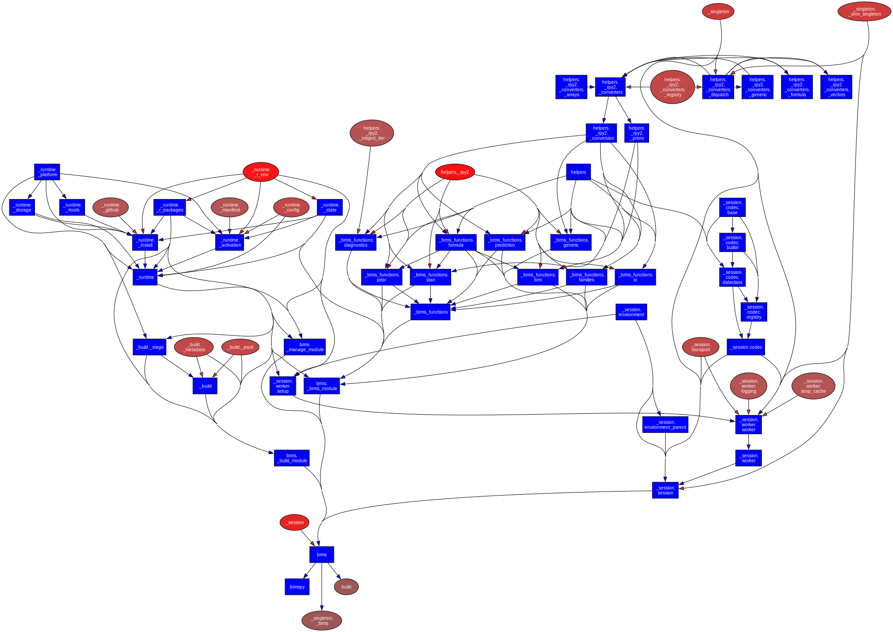
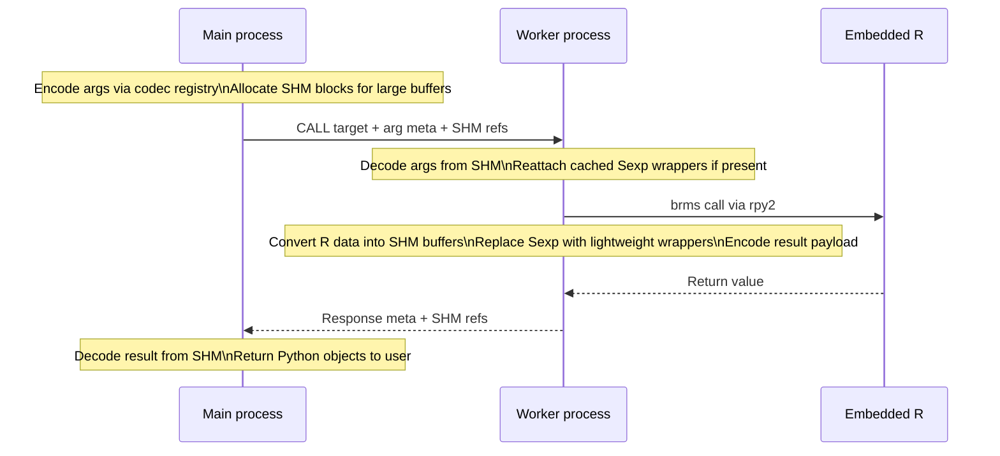

# Development Guide

This guide covers brmspy’s development workflows, architecture, testing strategy, and CI/CD.

brmspy has been refactored around an explicit process boundary:

- **Main process**: exposes a normal-looking `brmspy.brms` module surface to the user and IDEs and must **not** import `rpy2.robjects`.
- **Worker process**: runs the “real” brms/rpy2 code (and embeds R) and is isolated from the main process.
- **Embedded R**: lives inside the worker.

This is primarily about stability (segfault isolation), predictable environment management, and enabling “resettable” R sessions.

---

## Quick Start

### Prerequisites

- Python **3.10–3.14**
- R installed (CI uses R 4.5; prebuilt runtimes are fingerprinted by `{os}-{arch}-r{major}.{minor}`)
- A working toolchain if you use the “traditional” install path (prebuilt runtimes avoid most compilation)

### Setup

```bash
# Clone and setup
git clone https://github.com/kaitumisuuringute-keskus/brmspy.git
cd brmspy

# Create and install dev env (uses uv)
sh script/init-venv.sh
```

### Install R dependencies (brms + backend)

The recommended way to install and mutate the R-side environment is via `brms.manage()`.

Fast install with a prebuilt runtime:

```bash
python - <<'PY'
from brmspy import brms

with brms.manage() as ctx:
    ctx.install_brms(use_prebuilt=True)
PY
```

Traditional install (compiles packages and builds toolchain; can take ~20–30 minutes):

```bash
python - <<'PY'
from brmspy import brms

with brms.manage() as ctx:
    ctx.install_brms()
PY
```

---

## Project Architecture

### Directory Structure

```
├── brmspy/                    # Main package
│   ├── __init__.py
│   ├── _brms_functions         # Worker-only: brms:: wrappers
│   ├── _build                  # Worker-only: runtime packaging pipeline
│   ├── _runtime                # Worker-only: R/toolchain/runtime operations
│   ├── _session                # Main↔worker architecture (IPC + SHM + codecs)
│   ├── _singleton              # Internal singletons and SHM access
│   ├── brms                    # Public entry point (proxy in main, real module in worker)
│   ├── helpers                 # Logging and worker-only rpy2 converters
│   └── types                   # Public types and SHM helper types
├── .github/workflows/          # CI/CD pipelines
├── .runtime_builder/           # Docker for Linux runtime builds
├── docs/                       # mkdocs documentation
└── tests/                      # Test suite
```

### Import graph



---

## Architecture Overview (main ↔ worker ↔ embedded R)

### High-level picture


### Core concept: `brmspy.brms` is a proxy in the main process

In the **main process**, importing `from brmspy import brms` returns a *module-like proxy*:

- The proxy is implemented in `brmspy/brms/__init__.py` and uses the session layer in `brmspy/_session/session.py`.
- It mirrors the public API surface of the worker module for IDEs and static analysis.
- Any function call is forwarded to the worker over IPC, with arguments/results serialized via codecs and SHM.
- Importantly: the main process must not import `rpy2.robjects`.

In the **worker process** (`BRMSPY_WORKER=1`), `brmspy.brms` imports the real implementation module:

- `brmspy/brms/_brms_module.py` imports the brms wrappers under `brmspy/_brms_functions/` and may import/initialize rpy2 + embedded R.
- Optional autoloading is controlled by `BRMSPY_AUTOLOAD` (the main proxy typically spawns the worker with autoload enabled, but `brms.manage()` restarts it with autoload disabled).

### Why this split exists

Key goals:

- **Crash containment**: if embedded R segfaults, it takes down the worker, not the user’s main process/IDE.
- **Resettable R session**: the worker can be restarted, making it possible to “reset” R and switch runtime/environment state without restarting Python.
- **Predictable imports**: main process stays lightweight; worker is the only place that touches rpy2/brms.

---

## IPC: What crosses the process boundary

### Request / response model

At runtime, the proxy starts a worker using `multiprocessing` *spawn* semantics and wires:

- a `Pipe` for control + metadata messages
- a `SharedMemoryManager` for large payloads
- a log queue so worker logs/prints are forwarded into the parent’s logging handlers

The main process sends requests to the worker with:

- `cmd`: one of `CALL`, `PING`, `SHUTDOWN`, or internal test commands
- `target`: what to execute in the worker
- `args`/`kwargs`: encoded payloads (plus SHM buffer references)

The worker replies with:

- success/error fields
- an encoded return value payload

Startup is guarded by an explicit `PING` handshake to avoid race conditions and zombie workers.

### Target resolution

Targets are strings and support:

- **Module function**: `mod:pkg.module.func`
- **Attribute chain** (for class-based “surface” APIs like `manage()` and `_build()`): `mod:pkg.module::ClassName.method_name`

This is what allows `brms.manage().install_brms(...)` to work as a “normal-looking” call from the main process even though the work executes inside the worker.

### Example call flow (encode → run in worker → decode)



---

## Data transport: SHM + codecs + “no R objects in main”

### Shared memory (SHM)

Large data payloads are moved using shared memory blocks:

- The main process allocates SHM blocks via a `SharedMemoryManager` and passes only `(name, size)` references over the pipe.
- The worker attaches to blocks by name and reads/writes buffers in-place.
- Payloads sent over IPC contain only **metadata + SHM block references**, not the raw data.

Important detail: SHM blocks may be larger than the logical payload, so codecs carry an explicit `nbytes`/length in metadata and decoders slice buffers accordingly.

### Codec registry

All arguments and return values are passed through a codec registry (see `brmspy/_session/codec/`):

- Prefer SHM-backed codecs for large numeric data (NumPy, ArviZ, many pandas frames).
- Fall back to pickle only when needed, and log warnings for large pickle payloads.

Default codec priority is:

1. NumPy arrays (SHM-backed)
2. ArviZ `InferenceData` (stores underlying arrays in SHM; reconstructs datasets in-place)
3. pandas DataFrames (numeric-only; object dtype columns fall back to pickle)
4. Dataclasses (encodes fields recursively via the registry)
5. Pickle fallback (always available, but discouraged for large payloads)

Dataclass results (public brmspy result types) are encoded field-by-field by delegating each field back into the registry. This avoids per-function bespoke serialization logic.

### Handling R objects (`Sexp`)

**R objects are not shipped to the main process.**

- R objects live inside the worker as rpy2 `Sexp` instances.
- When a call returns an R object (or includes one inside a dataclass), it is replaced by a lightweight wrapper containing:
  - a stable internal id (`rid`)
  - a printable representation (for debugging)

When the main process sends such wrappers back to the worker later, the worker reattaches them from its `Sexp` cache.

This prevents rpy2/R object lifetimes from leaking into the main process and makes it harder to accidentally import/use rpy2 in the main process.

---

## R session safety and initialization

The worker configures embedded R for safer execution:

- Enforces `RPY2_CFFI_MODE=ABI` when possible (ABI mode is the recommended stable mode).
- Disables fork-based R parallelism that is unsafe in embedded R contexts (e.g. `future::multicore`, `parallel::mclapply`).
- Keeps cmdstanr sampling parallelism intact (that’s outside R’s fork-based parallel machinery).

This is the main reason you should avoid importing rpy2 directly in the main process: stability depends on initialization order and consistent environment configuration.

---

## Runtime + environment lifecycle

brmspy separates two concepts:

- **Runtime**: a prebuilt bundle containing R libraries + CmdStan binaries (or a “traditional” system install).
- **Environment**: a named, isolated user library for additional packages (e.g. “mrp”, “legacy”).

### On-disk layout

Typical `~/.brmspy` structure:

```
.brmspy
├── environment
│   ├── default
│   │   ├── config.json
│   │   └── Rlib
│   ├── mrp
│   │   ├── config.json
│   │   └── Rlib
│   └── legacy
│       ├── config.json
│       └── Rlib
├── environment_state.json
├── runtime
│   ├── macos-arm64-r4.5-0.2.0
│   │   ├── cmdstan
│   │   ├── hash
│   │   ├── manifest.json
│   │   └── Rlib
│   └── macos-arm64-r4.4-0.2.0
│       ├── cmdstan
│       ├── hash
│       ├── manifest.json
│       └── Rlib
└── runtime_state.json
```

Notes:

- Runtime selection is fingerprint-based: `{os}-{arch}-r{major}.{minor}` plus the runtime version.
- `runtime_state.json` stores the last configured runtime path.
- `environment_state.json` stores the last active environment name.

### `brms.manage()` semantics

`brms.manage(...)` is intentionally “strongly isolated” (see `brmspy/_session/session.py` and `brmspy/brms/_manage_module.py`):

- On enter:
  - the worker is restarted (fresh embedded R session)
  - autoloading is disabled for this session (autoload prevents safe unloading/switching)
  - the requested environment config is applied (or `default`)
  - the worker prepends `~/.brmspy/environment/<name>/Rlib` to R `.libPaths()`

- On exit:
  - environment config is persisted to `~/.brmspy/environment/<name>/config.json`
  - the active environment name is recorded in `~/.brmspy/environment_state.json`

This is the supported way to:

- install/uninstall R packages into an environment user library
- switch prebuilt runtimes / R_HOME without polluting the main process
- apply startup scripts in a controlled way
- avoid “mutated global R session” problems

Note: runtime configuration is stored separately in `~/.brmspy/runtime_state.json` (see `brmspy/_runtime/_config.py`).

---

## Invariants and guardrails

This refactor relies on strict invariants. Breaking them can reintroduce hard-to-debug segfaults and import-order issues.

### 1) Main process must not import `rpy2.robjects`

Enforced in multiple layers:

- **Import-linter contracts** forbid importing `rpy2.robjects` outside the allowlist (see `.importlinter` and `script/importlinter_contracts.py`). This is run via `lint-imports` (wired into `./run_tests.sh`).
- **Runtime sanity check**: importing `brmspy.brms` in the main process will raise if `rpy2.robjects` was already imported (this catches “import order footguns” early).
- **Test sentinel**: tests install a “bomb” in `sys.modules["rpy2.robjects*"]` in the main process so accidental access fails fast (see `tests/conftest.py`).

### 2) Worker-only modules must stay worker-only

Large parts of the codebase are explicitly worker-only, including:

- the rpy2 conversion helpers
- the brms wrapper functions
- runtime activation/install logic

The import-linter setup also enforces layering constraints between these modules to prevent dependency cycles and accidental “main imports worker-only” leaks.

---

## Testing

### Test markers and categories

- `@pytest.mark.requires_brms`
  - tests that need brms to be installed and loadable inside the worker
- `@pytest.mark.rdeps`
  - **destructive** R-dependency tests; only run when explicitly enabled
- `@pytest.mark.worker`
  - run the test function inside the worker process (useful for testing worker-only code paths safely)

### Main-process protection: “no rpy2 in tests”

Tests install a sentinel object in `sys.modules` for `rpy2.robjects*` in the main process so that any accidental usage fails fast.

This is intentional: it keeps contributor tests honest and ensures the “no rpy2 in main” invariant stays true.

### Running tests locally

Main test run (pytest + coverage combine + import-linter):

```bash
./run_tests.sh
```

Notes:

- `./run_tests.sh` runs `lint-imports` at the end (provided by the `import-linter` package).
- If `uv` is installed, the script prefers `uv run ...` for reproducibility.

R-dependency tests (destructive; opt-in):

```bash
BRMSPY_DESTRUCTIVE_RDEPS_TESTS=1 ./run_tests_rdeps.sh
```

Worker-marked tests:

```bash
pytest -m worker -v
```

Notes for `@pytest.mark.worker`:

- Worker tests currently must not use pytest fixtures (until fixture shipping is implemented).
- Worker tests are executed by telling the worker to import the test module and call the function by name (an internal `_RUN_TEST_BY_NAME` command).
- In non-rdeps runs, the test collection step tries to ensure a prebuilt brms environment exists (typically named `_test`) so contributor test runs work “out of the box” without manual R setup.

---

## CI/CD

Workflows live in `.github/workflows/`.

### `python-test-matrix`

- Builds and caches CmdStan + R libs per OS (cache keys include cmdstanr/brms/posterior and CmdStan 2.36.0).
- Runs Python matrix:
  - Linux: Python 3.10 / 3.12 / 3.14
  - macOS/Windows: Python 3.12
- Uses R 4.5 in CI and fixes ABI-mode environment vars (R_HOME + LD_LIBRARY_PATH on Unix).
- Runs `./run_tests.sh` (pytest + coverage combine + `lint-imports`).
- Updates the main coverage badge from the Ubuntu 3.12 job on `master`.

### `r-dependencies-tests`

- Runs destructive R dependency tests on Linux/macOS/Windows.
- Enables destructive mode via `BRMSPY_DESTRUCTIVE_RDEPS_TESTS=1`.
- Ensures ABI-mode environment setup (R_HOME + platform-specific dynamic library search config).
- On Windows, caches and provides an Rtools installer so toolchain installation can be tested.
- Runs `./run_tests_rdeps.sh` which executes `pytest -m rdeps` and merges coverage shards.
- Uploads per-OS coverage artifacts and merges them on Ubuntu for a combined rdeps coverage badge.

### `runtime-publish`

Manual workflow to build prebuilt runtimes for:

- OS: Linux (in Docker), macOS, Windows
- R versions: 4.0 through 4.5

Linux builds happen inside the pinned builder image to keep glibc compatibility stable.

The runtime archive is produced by:

```bash
python -m brmspy.build --output-dir dist/runtime --runtime-version "$RUNTIME_VERSION"
```

### `python-publish`

- Runs tests, builds distributions, uploads to PyPI on release tags following the repo conventions.
- Uses cached CmdStan + R libs similarly to the test matrix.

### `docs`

- Builds mkdocs and deploys GitHub Pages on push to `master`.

---

## Debugging worker issues

### Understand the logging pipeline

Worker output is forwarded to the main process:

- Worker uses a log queue to forward Python logging records to the parent’s handlers.
- Worker also overrides `print()` so that raw output (including carriage returns used by progress bars) is emitted via logging without losing control characters.

Practical consequence: R output, cmdstan progress, and Python logs all show up in one stream when the main process logger is configured.

### Common environment variables

These are the most relevant knobs when diagnosing issues:

- `BRMSPY_WORKER=1`
  - run “worker mode” directly (no proxy). This is useful to isolate “IPC/proxy” issues from “rpy2/R” issues during debugging, but it is not the recommended normal usage mode.
- `BRMSPY_AUTOLOAD=0|1`
  - whether the worker should auto-activate the last runtime from `runtime_state.json` on startup
- `BRMSPY_TEST=1`
  - enables some test-only paths (notably worker test execution by name)
- `BRMSPY_DESTRUCTIVE_RDEPS_TESTS=1`
  - required to run `@pytest.mark.rdeps`
- `RPY2_CFFI_MODE=ABI`
  - recommended for stability
- `R_HOME`
  - explicit R home directory; can help when multiple R installations exist
- `LD_LIBRARY_PATH`
  - Unix-only; must include `$R_HOME/lib` for ABI mode to find libR. The main session tries to construct this itself for current R home.
- `PATH` (Windows)
  - must include the R `bin/x64` directory so DLLs are discoverable

### Reproducing failures

Prefer short, deterministic repro scripts that:

- create a new environment via `brms.manage(environment_name="...")`
- install dependencies
- run a single operation (`brms.brm`, `brms.loo`, etc.)

Example structure:

```python
from brmspy import brms

with brms.manage(environment_name="repro") as ctx:
    ctx.install_brms(use_prebuilt=True)

# then run the minimal call that crashes
```

### Restarting a stuck session during development

The proxy owns the worker lifecycle. If the worker gets into a bad state during development, restarting the Python process is the most reliable reset.

For internal debugging, the proxy also supports restarting/shutdown, but these are not public API guarantees and may change.

---

## Documentation

Docs are built with mkdocs (see `mkdocs.yml`) and deployed via the `docs` GitHub Actions workflow.

### Docstring style

Docstrings use NumPy style and Markdown fenced code blocks.

---

## Contributing

### Code style

- Format/lint: `ruff`
- Type checking: `mypy`
- Import discipline: `import-linter` (run as part of `./run_tests.sh`)

### PR expectations

- Keep the “no rpy2 in main process” invariant.
- Prefer adding coverage via:
  - main-process tests for proxy behavior, codec behavior, and high-level API behavior
  - `@pytest.mark.worker` tests for worker-only implementation details
